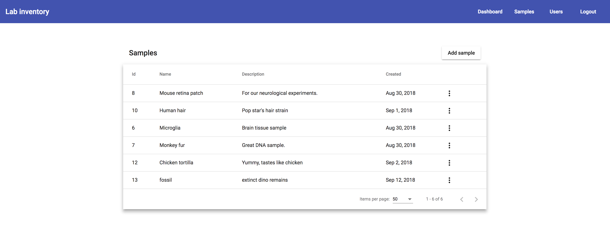

# Laboratory inventory app

Proof of concept application for managing laboratory inventory (samples).




## Application structure
- REST API written in Java using Spring Boot. Uses gradle.
- Web application created using Angular (2+/6) framework.
- Database: MySQL

Deployment is orchestrated using docker and docker-compose.

## Prerequisites
To run the application you just need docker and docker-compose.
https://docs.docker.com/install/

## Running the application
Development
```
docker-compose up
```

Production
```
docker-compose -f docker-compose.prod.yml
```

## References
- Angular app structure: https://medium.com/@motcowley/angular-folder-structure-d1809be95542
